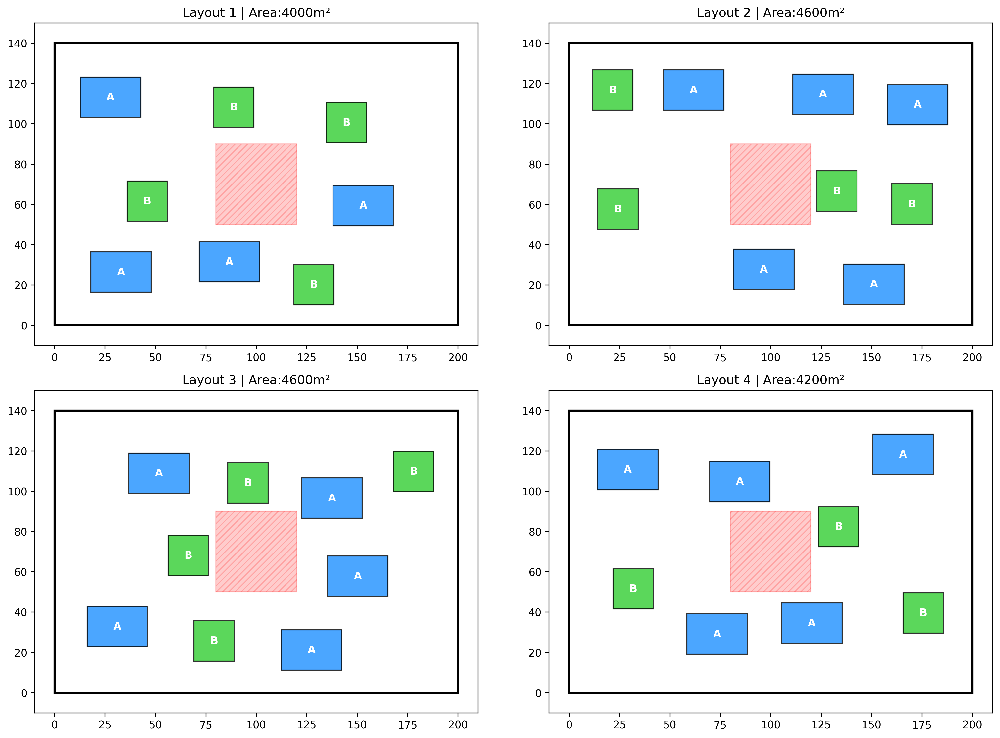

# 📐 Generative Site Layout Optimizer

This project is a **rule-based generative layout tool** that automatically produces and visualizes valid building configurations on a site using Python. It simulates architectural massing under spatial, regulatory, and relational constraints, then outputs the **best-performing layouts** based on total built area.

The script randomly generates building placements, validates them against constraints, and visualizes the top results using **Matplotlib**.

---

<p align="center">
  
</p>


## ✨ Features

- 📏 Fixed site boundary with buffer offsets  
- 🟥 Central plaza exclusion zone  
- ↔️ Minimum separation distance between buildings  
- 🏢 Two building types with different footprints  
- 🔗 Proximity rule enforcing functional adjacency  
- 🔄 Randomized generative search  
- 📊 Automatic visualization of top layouts  

---

## 🗺️ Site & Building Rules

### Site
- **Dimensions:** `200m x 140m`
- **Boundary buffer:** `10m`
- **Central plaza:**  
  - Position: `(80, 50)`  
  - Size: `40m x 40m`  
  - No buildings allowed inside

### Buildings
| Type | Width | Height |
|------|-------|--------|
| A    | 30m   | 20m    |
| B    | 20m   | 20m    |

---

## 📐 Constraints Enforced

1. **Boundary & Buffer Constraint**  
   Buildings must stay within the site and outside the 10m buffer.

2. **Plaza Exclusion**  
   No building may overlap the central plaza.

3. **Minimum Separation**  
   All buildings must be at least **15m apart**.

4. **Neighbor Rule**  
   Every **Tower A** must have **at least one Tower B within 60m** (center-to-center distance).

5. **Minimum Viability**
   - At least **3 Tower A**
   - At least **6 total buildings**

---

## ⚙️ How It Works

1. Randomly places buildings on the site  
2. Validates each placement against all constraints  
3. Forces initial placement of Tower A buildings  
4. Fills remaining space with Tower A or B  
5. Validates proximity rules using `NearestNeighbors`  
6. Computes total built area  
7. Stores and visualizes the **top 4 valid layouts**

---

## 🖼️ Output

- **Blue:** Tower A  
- **Green:** Tower B  
- **Red (hatched):** Central Plaza  
- Each layout displays total built area (m²)

---

## 📦 Dependencies

Install required packages:

```bash
pip install matplotlib numpy scikit-learn
